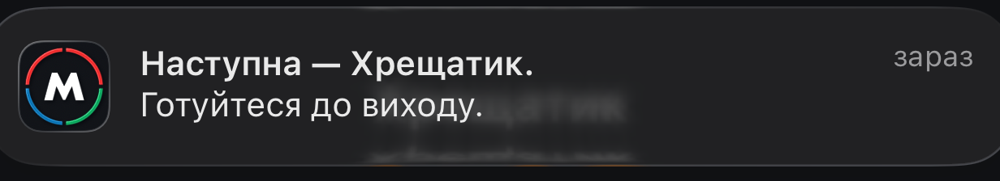
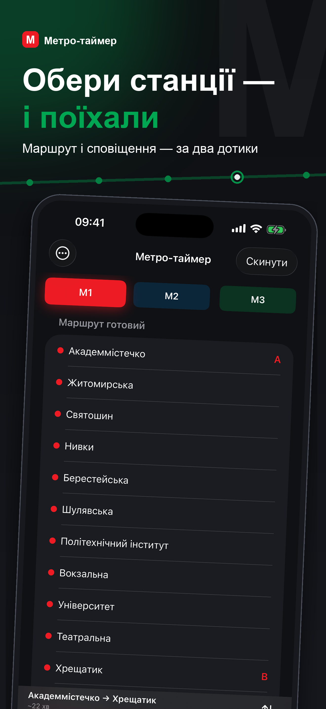
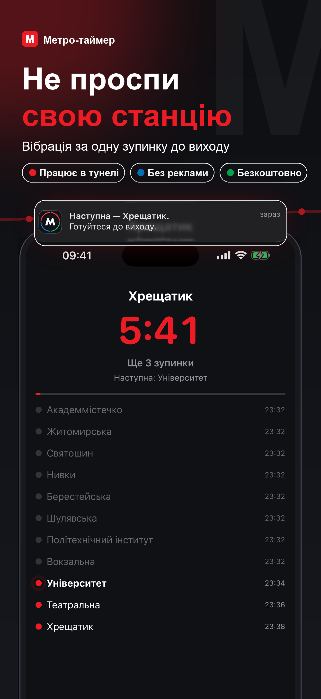
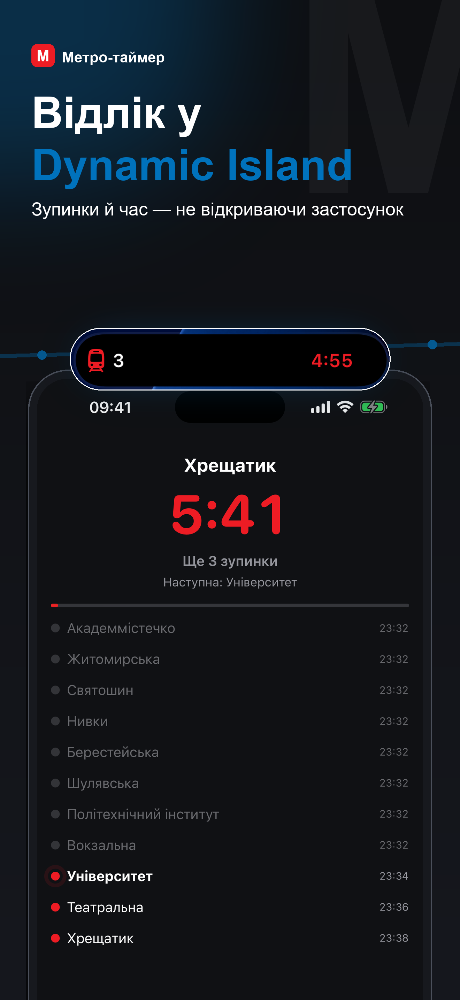

# Metro Timer: Kyiv

**A ride countdown that lives in the Dynamic Island — with no GPS, no network, and no background execution.**




You pick where you get on and where you get off, and you tap **Start** the moment
the train pulls out. A countdown to your station appears on the Lock Screen and in
the Dynamic Island, along with the number of stops left. One station before yours,
the phone buzzes.

<table>
  <tr>
    <td></td>
    <td></td>
    <td></td>
    <td></td>
    <td></td>
  </tr>
</table>

---

## The problem

On the metro you read, doze off, or put headphones on — and then you look up at
the wrong station. Announcements do not help if you cannot hear them, and there is
no signal down there to check a map.

## The constraint that shapes everything

Three things are unavailable to this app, and only two of them are anyone's fault:

- **No GPS underground.** Physics. Eight of the network's fifty-two stations are
  above ground; the rest are in tunnels where satellites are not an option.
- **No network.** Same tunnels.
- **No background execution.** This one is a decision, not a limitation. Background
  modes cost battery, invite App Review questions, and buy nothing here that a
  pre-scheduled notification does not already provide.

So the train's position cannot be *measured*. It has to be *computed* — from a
timetable, anchored to the single event a passenger can supply for free: the moment
the train starts moving.

That one tap is the whole contract. Everything else follows from it.

## How it works

1. **Route.** Departure and destination, on one line or across two. In Kyiv any pair
   of lines meets at exactly one transfer node, which keeps routing to a lookup
   rather than a graph search.
2. **Anchor.** The moment you tap Start becomes t₀. The app records it synchronously,
   before any permission dialog can appear and skew it.
3. **Schedule.** Arrival and departure for every station on the route are computed
   up front, along with the alert moment and the arrival moment.
4. **Notifications.** Both are scheduled immediately as
   `UNTimeIntervalNotificationTrigger`. They fire even if the app is force-quit
   on the platform.
5. **Countdown.** Drawn by SwiftUI itself via `Text(timerInterval:)`. No process has to
   stay alive for it to keep ticking.
6. **Live Activity.** Stops remaining, next station, a segmented route bar. On iOS 17+
   the **−1 / +1** and **"train departed"** buttons are `LiveActivityIntent`s, so a tap
   on the Lock Screen wakes the app's own process and reschedules everything.

Where the model is uncertain, the passenger is the sensor. A correction takes one tap
and never requires unlocking the phone.

## Where the numbers come from

Segment times are derived from the official Kyiv Metro timetable published on the
city's open data portal — not estimated, not crowdsourced.

`Scripts/derive_official_times.py` reads the departure times of the first and last
train at every station in both directions. The difference between adjacent stations
is running time plus dwell. That yields up to four samples per segment; the script
takes the median of the plausible ones (60–420 s) and discards outliers produced by
trains starting mid-line from a depot.

At runtime each segment resolves through a fallback chain, and running time and dwell
fall back **independently** — measuring one does not overwrite the other:

| Priority | Source |
|---|---|
| 1 | On-device calibration for this exact direction |
| 2 | Official seed for this direction |
| 3 | Official seed for the mirrored direction |
| 4 | Default: 115 s running, 25 s dwell |

Calibration comes from a dedicated screen where you tap at each stop and start, and
passively from GPS while the train is on the surface. Both feed the same running
average.

## What it can't know

Being explicit about this is part of the design, not a caveat bolted on afterwards.

**Waiting for a train after a transfer.** This is genuinely unknowable: anywhere from
zero to a full headway. The model books a quarter of the current headway rather than
the "correct" half, because the two errors do not cost the same. Underestimate, and the
countdown runs *ahead* of the train: the passenger looks up early and keeps riding.
Overestimate, and the warning arrives *after* their station. The whole product exists to
prevent the second one. So the estimate leans early on purpose — and a **"train
departed"** button in the Live Activity lets the passenger erase the uncertainty entirely.

**The stop counter freezes in the background.** With no background modes, ActivityKit
cannot be handed a deferred update. The timer keeps running on its own, but "3 stops
left" holds its last pushed value until something wakes the app — opening it, tapping
±1, or a GPS fix on the surface. That is the price of the third constraint above, and
it was paid knowingly.

## Architecture

| Target | Contents |
|---|---|
| `App/` | SwiftUI screens, plus services that only make sense in the app: accelerometer, GPS corrector, air-raid polling |
| `Shared/` | Compiled into **both** app and widget: models, `TripPlanner`, `TripEngine`, `ActivityController`, `NotificationScheduler`, strings |
| `Widget/` | Live Activity presentation only — Dynamic Island compact/minimal/expanded, and the Lock Screen card |

`TripEngine` is the single owner of trip state. Every mutation — start, manual
correction, GPS snap, finish — goes through it, and each one re-derives the schedule,
reschedules notifications, and pushes a fresh Live Activity state. The widget never
computes anything; it renders a `ContentState` it was handed.

Both languages live as **pairs on one line**:

```swift
static var lastStopAhead: String { tr("Наступна — ваша", "Yours is next") }
```

There is no `.strings` file to fall out of sync, because there is no key to forget.

## Testing

28 tests over the core, run inside the app process so they read the real bundled data
rather than a fixture:

- **`PlannerTests`** — route composition, monotonic times, dwell placement, transfers,
  ±1 corrections at both boundaries, notification payloads, Live Activity state stability
  (the state must *not* change mid-segment, or the island would push needlessly)
- **`ScheduleTests`** — headway interpolation inside the hour, weekday vs weekend,
  behaviour outside service hours, first/last train warnings
- **`DataTests`** — bundled data consistency, coordinates inside a Kyiv bounding box,
  surface stations far enough apart for a 400 m GPS snap to be unambiguous
- **`LocalizationTests`** — every sampled string actually changes with the language, and
  no Cyrillic survives into the English build

## Privacy

The app ships with no analytics, no advertising, no third-party SDKs, and no account.
Exactly one feature touches the network — optional air-raid alerts — and it is off until
you turn it on.

Everything written to disk (trip journal, calibration, and in Calibration mode the raw
accelerometer and location traces) gets `FileProtectionType.completeUnlessOpen` and is
excluded from iCloud and iTunes backups. A stolen powered-off phone does not give it up,
and "stays on your device" is a statement about file attributes rather than a promise.
Both targets ship a `PrivacyInfo.xcprivacy`.

## Status

**Pre-release.** Not on the App Store yet.

*Done:* feature-complete v1.0 — routing with transfers, service hours, Live Activity with
interactive corrections, calibration, trip journal, Ukrainian and English throughout,
VoiceOver labels, Reduce Motion, App Store listing metadata, privacy policy and support
page.

*Remaining:* field validation. The trip journal records the plan against the outcome and
counts every correction precisely so accuracy can be measured rather than asserted — and
that data does not exist yet. No accuracy figure is claimed here for that reason.

One open modelling question is worth naming: the headway table encodes each hour as a
pair of values that the model interpolates across the hour. Roughly half the hour
boundaries in the source data are discontinuous, which suggests the field may instead be
a min–max range for the hour. Resolving it against the source layer may shift the
transfer-wait estimate.

## Build

```bash
xcodebuild -project MetroTimer.xcodeproj -scheme MetroTimer \
  -destination 'platform=iOS Simulator,name=iPhone 17 Pro Max' test
```

The Xcode project is committed and has no dependencies — clone and open. Generators,
data derivation, debug hooks and repository layout are in **[docs/BUILD.md](docs/BUILD.md)**.
The GPS correction design is in [docs/GPS.md](docs/GPS.md).

## Data and credits

- Timetable, headways and service hours: [Kyiv open data portal](https://data.kyivcity.gov.ua/dataset/rozklad-rukhu-miskoho-elektrychnoho-ta-avtomobilnoho-transportu-dep-transport), dataset «Розклад руху міського електричного та автомобільного транспорту»
- Station coordinates: © OpenStreetMap contributors (ODbL)

Unofficial app. Not affiliated with or endorsed by Kyiv Metro
(КП «Київський метрополітен»).
